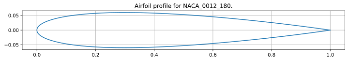
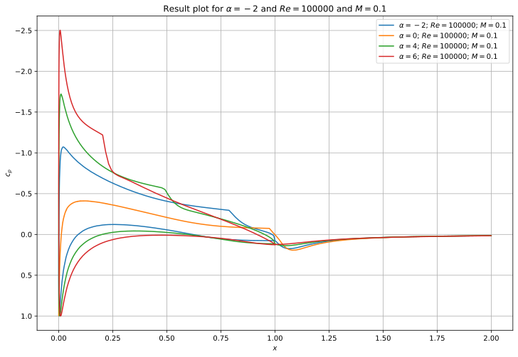
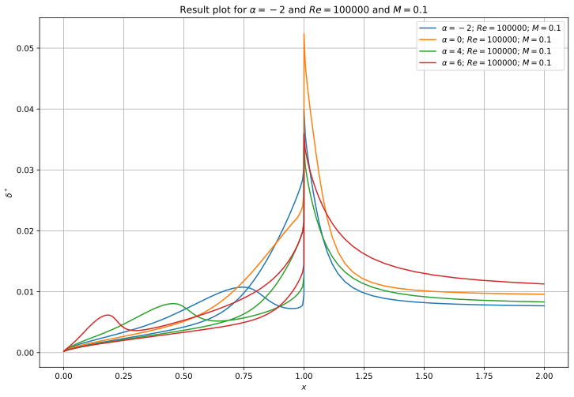
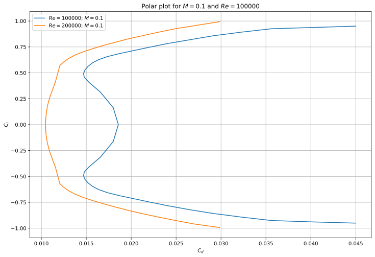
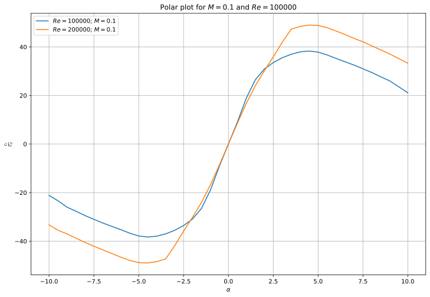
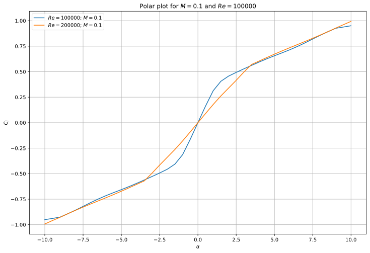

# pyxfoil
Run XFoil from within Python and work with output results.

See example below:

#
``` python
# Import Dependencies
from pyxfoil import Xfoil, set_workdir#, set_xfoilexe
set_workdir('C:/Xfoil_WIP') # Sets the working directory for pyxfoil.
# set_xfoilexe('C:/Xfoil-6.99/xfoil.exe') # Sets the path of the xfoil executable.
```

#
``` python
# Creates Xfoil object from reading dat file.
xfoil = Xfoil('NACA 0012')
xfoil.points_from_dat('../files/NACA_0012_180.dat')
xfoil.set_ppar(180)
```

#
``` python
# Runs xfoil for the following parameters
al = [-2.0, 0.0, 4.0, 6.0]
mach = 0.1
re = 100000.0
for ali in al:
    rescase = xfoil.run_result(ali, mach=mach, re=re)
```

#
``` python
# Plots xfoil airfoil profile
ax1 = xfoil.plot_profile(ls='-')
```


#
``` python
# Shows plots for cases in xfoil cases
ax2 = None
for resname in xfoil.results:
    ax2 = xfoil.results[resname].plot_result(yaxis='cp', ax=ax2, ls='-x')
_ = ax2.legend()
```


#
``` python
# Shows plots for cases in xfoil cases
ax3 = None
for resname in xfoil.results:
    ax3 = xfoil.results[resname].plot_result(yaxis='ds', ax=ax3, ls='-o')
_ = ax3.legend()
```


#
``` python
# Run the xfoil in polar mode from alpha min to alpha max with interval
re = 100000.0
almin = -10.0
almax = 10.0
alint = 0.5
polar1 = xfoil.run_polar(almin, almax, alint, mach=mach, re=re)
```

#
``` python
# Run the xfoil in polar mode from alpha min to alpha max with interval
re = 200000.0
almin = -10.0
almax = 10.0
alint = 0.5
polar2 = xfoil.run_polar(almin, almax, alint, mach=mach, re=re)
```

#
``` python
# Plot two polars created above
axp1 = None
axp1 = polar1.plot_polar(ax=axp1)
axp1 = polar2.plot_polar(ax=axp1)
_ = axp1.legend()
```


#
``` python
# Plot two lift to drag ratios created above
axp2 = None
axp2 = polar1.plot_polar(ax=axp2, xaxis='alpha', yaxis='clocd', ls='-o')
axp2 = polar2.plot_polar(ax=axp2, xaxis='alpha', yaxis='clocd', ls='-x')
_ = axp2.legend()
```


#
``` python
# Plot two lift curves created above
axp3 = None
axp3 = polar1.plot_polar(ax=axp3, xaxis='alpha', yaxis='cl', ls='-o')
axp3 = polar2.plot_polar(ax=axp3, xaxis='alpha', yaxis='cl', ls='-x')
_ = axp3.legend()
```

